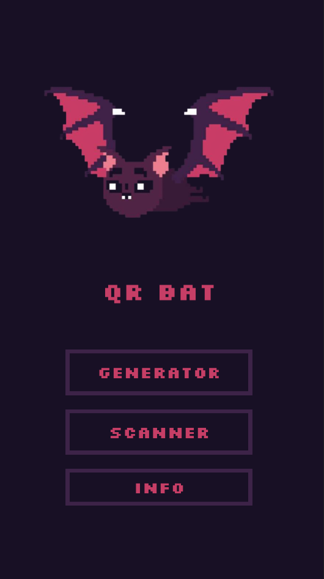
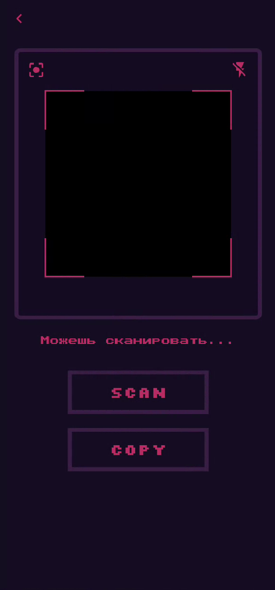
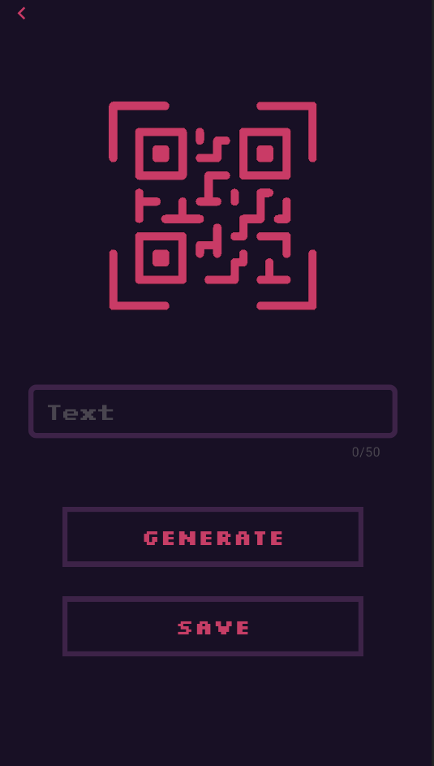

## Улучшенное приложение QR-Bat

# Описание
В ходе практики я провёл значительные улучшения существующего приложения QR-Bat, основываясь на предыдущей разработке. В результате были достигнуты следующие результаты:

# Генерация QR-кода
Я провёл значительную доработку и оптимизацию функциональности генерации QR-кода. Теперь пользователь может вводить текст и генерировать соответствующий QR-код.

Была добавлена функциональность запроса разрешения на доступ к памяти устройства для сохранения сгенерированного QR-кода в папку загрузок. Приложение отслеживает результат запроса разрешения, и в случае отказа пользователя в доступе, функциональность генератора QR-кода будет недоступна.

# Сканирование QR-кода
Добавлена возможность сканировать QR-коды с помощью камеры устройства. Также реализована функциональность запроса разрешения на использование камеры. Если пользователь не предоставил разрешение на использование камеры, функциональность сканера QR-кода будет отключена.

# Сохранение сгенерированного QR-кода
Теперь пользователь может сохранить сгенерированный QR-код в галерее устройства. Для этого было добавлено разрешение на доступ к памяти устройства. В случае отказа пользователя в доступе к памяти, функциональность сохранения QR-кода будет недоступна.

# Копирование текста со сканированного QR-кода
Добавлена возможность копировать текст, содержащийся в сканированном QR-коде, в буфер обмена устройства.

# Редизайн приложения
Мы также провели редизайн приложения, включающий изменение цветовой схемы, расположения элементов и общего стиля. Это позволило создать более привлекательный и современный внешний вид, а также повысить общую эстетику и юзабилити приложения.

  

    
  

  

    
  

  

    

## License
This project is licensed under the [CC BY-NC 4.0](https://creativecommons.org/licenses/by-nc/4.0/legalcode) license. See the [LICENSE](LICENSE) file for more details.
